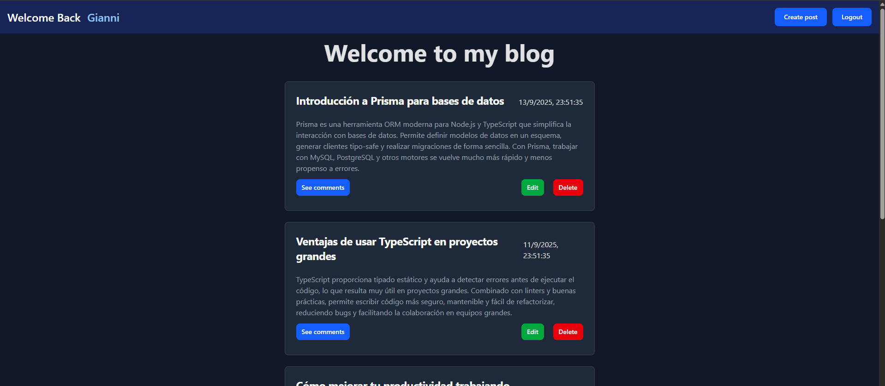
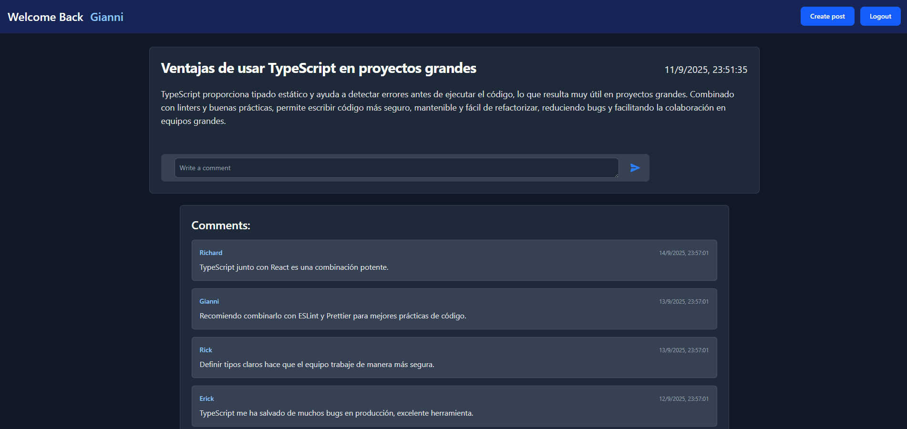
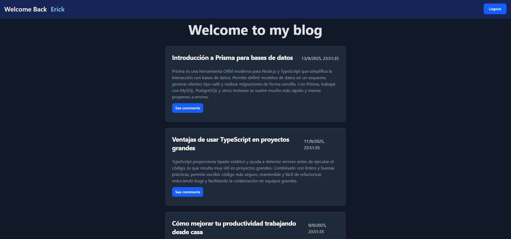

# 📝 Blog Platform - Full Stack Project

This is a **full stack blog platform** built with **Node.js + Express** on the backend and **React + TailwindCSS** on the frontend.  
The application allows **admins** to manage content (create, edit, delete posts) and **regular users** to register, log in, and leave comments on posts, also the non logged users can't comment on posts

---
### 📸 Screenshots

#### **Admin View**


#### **Logged-in User Comments View**


#### **Non-Admin View**


## ✨ Features

### 👤 User Authentication & Authorization
- Secure registration and login system.  
- Sessions managed via **JWT tokens** stored safely on the client.  
- Role-based access (**Admin / User**).  

### 🛡️ Backend Security & Validations
- Data validation with middleware (e.g., `express-validator`).  
- Passwords hashed with **bcrypt**.  
- Protected routes that require valid JWT to access.  

### 📰 Blog Management
- Admins can **publish, edit, and delete posts**.  
- Users can **browse posts**, leave comments, and interact with content.  

### 💬 Comments System
- Registered users can **comment on blog posts**.  
- Each comment is linked to both a **user** and a **post**.  

### ⚡ Frontend
- Built with **React + Tailwind**.  
- Modern UI with **responsive design**.  
- Client-side routing for pages (e.g., Home, Login, Signup, Posts...).  

---

## 🛠️ Technologies Used

### Backend
- 🟢 **Node.js + Express** – Server and API.  
- 🗄️ **MySql** (I'm using prisma) – Database for users, posts, and comments.  
- 🔑 **JWT (JSON Web Tokens)** – Authentication and session management.  
- 🧂 **bcrypt** – Secure password hashing.  
- 🛡️ **express-validator** – Input validation middleware.  

### Frontend
- ⚛️ **React** – Client-side UI.  
- 🎨 **TailwindCSS** – Styling and responsive design.  
- 🔄 **Axios / Fetch** – API communication.

## 🚀 Installation Guide

Follow these steps to set up and run the project locally:

### 1. Clone the Repository
```bash
git clone <repository-url>
cd fullstack-blog-app
```

### 2. Install Backend Dependencies
Install dependencies and then move to `Backend` folder
```bash
npm install
cd BACKEND
```

### 3. Configure Environment Variables
Create a `.env` file inside the `BACKEND` folder with the following variables:
```env
JWT_SECRET=your_jwt_secret
DB_URL=your_database_url
```

Replace `your_jwt_secret` with a secure secret key and `your_database_url` with your database connection string.

### 4. Start the Backend Server
Go back to the root directory and start the backend server:
```bash
cd ..
npm run dev
```

### 5. Install Frontend Dependencies
Navigate to the `FRONTEND` folder and install the required dependencies:
```bash
cd FRONTEND
npm install
```

### 6. Start the Frontend Server
Run the following command to start the frontend development server:
```bash
npm run dev
```

### 7. Open the Application
Once the frontend server is running, open the provided link in your browser (usually `http://localhost:5173`).

---

### 📂 Project Structure
```sh
└── fullstack-blog-app/
    ├── BACKEND
    │   ├── app.js
    │   ├── config
    │   ├── controllers
    │   ├── prisma
    │   ├── routes
    │   ├── services
    │   ├── validators
    |   └── .env
    ├── FRONTEND
    │   ├── eslint.config.js
    │   ├── index.html
    │   ├── package-lock.json
    │   ├── package.json
    │   ├── public
    │   ├── src
    │   └── vite.config.js
    ├── package-lock.json
    └── package.json
```